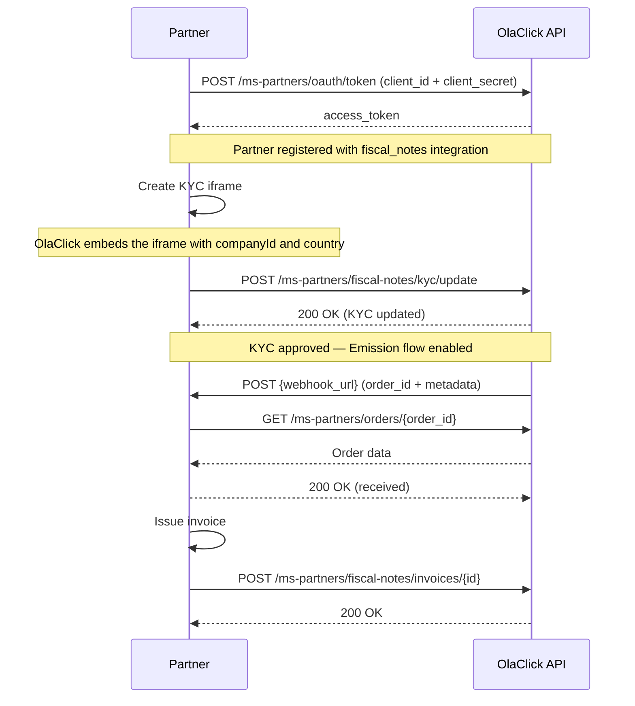

# Get Started

Welcome to the **OlaClick Partners** integration portal.

This documentation describes how to integrate your platform with OlaClick as a registered partner.

## General Flow

## Steps to Integrate

1. **Onboarding** — Register as an OlaClick Partner and receive your `client_id` and `client_secret`.
2. **Authentication** — Use your credentials to obtain an access token (OAuth 2.0 Client Credentials).
3. **Create the KYC iframe** — Implement the iframe where clients will complete their document validation.
4. **Activate the integration** — Once KYC is validated, notify OlaClick that the integration is active for a company.
5. **Receive order notifications** — OlaClick sends order IDs to your webhook for invoice emission.
6. **Fetch order data** — Use the Orders API to get the full order details.
7. **Notify invoice issued** — Once the invoice is emitted, notify OlaClick with the invoice data.
8. **Homologation** — Complete the homologation process to receive production credentials.

## Architecture

| Service | Responsibility |
|---------|---------------|
| **ms-partners** | Partner registration, credentials, OAuth tokens, company access (integrations), KYC state |
| **Fiscal Notes** | Invoice emission logic, webhook delivery |
| **Orders** | Order data access |

## Concepts

| Concept | Description |
|---------|-------------|
| **OlaClick Partner** | A registered third-party provider with credentials and assigned integrations |
| **Integration** | A module the partner has access to (e.g. `fiscal_notes`). Determines scopes. |
| **Company access** | Which OlaClick companies the partner can serve (managed via integrations table) |
| **KYC** | Document validation state per company, managed in ms-partners |

## Base URL

| Environment | URL |
|-------------|-----|
| **Production** | `https://api.olaclick.app/ms-partners` |
| **Staging** | `https://api.olaclick-stg.click/ms-partners` |

:::info
All API requests require authentication via Bearer token. See the [Authentication](/authentication) section for details.
:::
