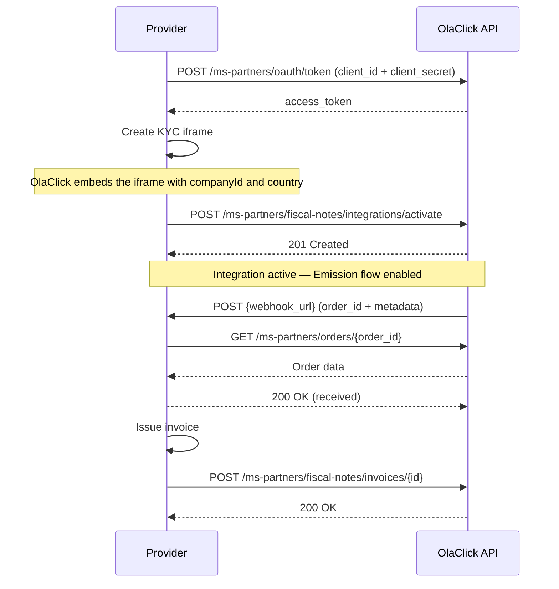

# Get Started

Welcome to the **OlaClick** integration portal for fiscal notes providers.

This documentation describes how to integrate your platform with OlaClick to offer electronic invoicing services to our clients.

## General Flow

## Steps to Integrate

1. **Onboarding** — Fill out the integration form and receive your `client_id` and `client_secret`.
2. **Authentication** — Use your credentials to obtain an access token (OAuth 2.0 Client Credentials).
3. **Create the KYC iframe** — Implement the iframe where clients will complete their document validation.
4. **Activate the integration** — Once KYC is validated, notify OlaClick that the integration is active.
5. **Receive order notifications** — OlaClick sends order IDs to your webhook for invoice emission.
6. **Fetch order data** — Use the Orders API to get the full order details.
7. **Notify invoice issued** — Once the invoice is emitted, notify OlaClick with the invoice data.
8. **Homologation** — Complete the homologation process to receive production credentials.

## Modules

| Module | Description |
|--------|-------------|
| **Partners** | Onboarding, credentials, and integration creation |
| **Fiscal Notes** | KYC document collection and invoice emission |
| **Orders** | Fetch order data for invoice processing |

## Base URL

| Environment | URL |
|-------------|-----|
| **Production** | `https://api.olaclick.app/ms-partners` |
| **Staging** | `https://api.olaclick-stg.click/ms-partners` |

:::info
All API requests require authentication via Bearer token. See the [Authentication](/authentication) section for details.
:::
