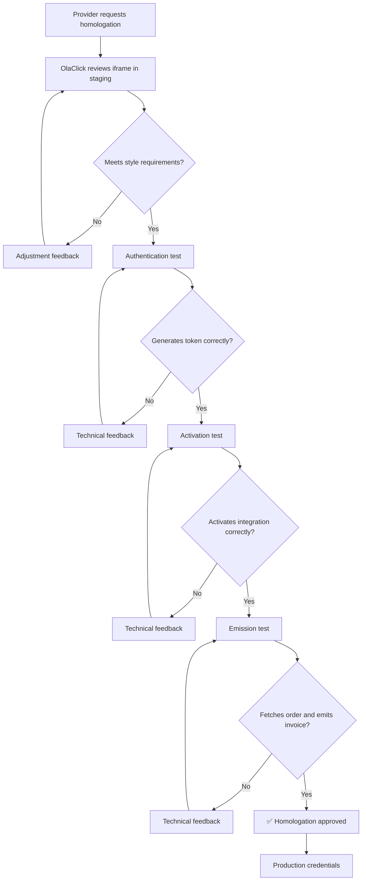

# Homologation

Before an integration can go to production, the provider must complete a homologation process with the OlaClick team. This process verifies that all integration components work correctly and meet quality standards.

## Requirements

The homologation evaluates three main aspects:

### 1. KYC Iframe — Style Compliance

The iframe must follow the [Style Guide](/modules/fiscal-notes/kyc-iframe#style-guide) defined in the iframe documentation. The following will be verified:

| Criteria | Description | Required |
|----------|-------------|:--------:|
| Color palette | Uses OlaClick's official colors (`#006FFF`, `#003E8F`, etc.) | ✅ |
| Typography | Uses `Inter` or a compatible sans-serif | ✅ |
| Buttons | Follow the defined style (border-radius, colors, hover) | ✅ |
| Inputs | Follow the defined style (border, focus state, error state) | ✅ |
| Responsive | Adapts correctly to different screen widths | ✅ |
| Background | White or light gray, no dark backgrounds or custom colors | ✅ |
| No own branding | Does not prominently display the provider's logos | ✅ |
| Clear UX | Progress indicators, real-time validation, clear messages | ✅ |

:::tip
We recommend sending screenshots or a staging link of the iframe before scheduling the formal review. This speeds up the process.
:::

### 2. Authentication — Token Generation

The provider must demonstrate that it can:

- Obtain an `access_token` using the [`POST /ms-partners/oauth/token`](/authentication) endpoint with its credentials (`client_id` and `client_secret`)
- Correctly handle token expiration and renew it before it expires
- Include the token in the `Authorization: Bearer {token}` header in all requests

**Required test:** Make a successful call to the authentication endpoint and obtain a valid token in the staging environment.

### 3. Integration Activation

The provider must demonstrate that it can:

- Call the [`POST /ms-partners/fiscal-notes/kyc/update`](/modules/fiscal-notes/activate-integration) endpoint with a valid `company_id`
- Send `status: "active"` when KYC validation is successful
- Send `status: "rejected"` with a `description` when validation fails
- Correctly handle errors (`COMPANY_DOES_NOT_EXIST`, `COMPANY_ALREADY_INTEGRATED`, `COMPANY_NOT_ELIGIBLE`, etc.)

**Required test:** Successfully activate a test integration in the staging environment, transitioning from `pending` to `active`.

### 4. Invoice Emission

The provider must demonstrate that it can:

- Receive order notifications on their webhook endpoint and respond with `200 OK`
- Verify the `X-OlaClick-Signature` header
- Fetch the full order data using [`GET /ms-partners/orders/{order_id}`](/modules/orders/get-order)
- Call [`POST /ms-partners/fiscal-notes/invoices/{id}`](/modules/fiscal-notes/notify-invoice) with `status: "issued"` when the invoice is emitted
- Call [`POST /ms-partners/fiscal-notes/invoices/{id}`](/modules/fiscal-notes/notify-invoice) with `status: "error"` when emission fails
- Handle idempotency (same `invoice_id` received twice should not produce duplicate invoices)

**Required test:** Receive a test order notification, fetch the order, emit a test invoice, and notify OlaClick successfully in the staging environment.

## Homologation Process



## Steps

1. **Request homologation** — Contact the OlaClick integrations team indicating that the integration is ready for review.
2. **Provide staging access** — Share the iframe URL in the staging environment for visual review.
3. **Style review** — OlaClick reviews that the iframe complies with the style guide. If adjustments are needed, feedback is sent.
4. **Functional tests** — It is verified that the provider can generate tokens, activate integrations, and process invoices correctly.
5. **Approval** — Once approved, production credentials are delivered.

## Staging Environment

For homologation tests, OlaClick provides a staging environment:

```
Base URL: https://api.olaclick-stg.click/ms-partners
```

Specific staging credentials will be provided for the homologation process.

## Rejection Criteria

Homologation will be rejected if:

- ❌ The iframe uses colors that do not match the OlaClick palette
- ❌ The iframe is not responsive or breaks on small screens
- ❌ The provider cannot generate a valid token
- ❌ The provider does not correctly handle API errors
- ❌ The iframe redirects outside the context or opens unauthorized popups
- ❌ The form does not validate fields in real time
- ❌ No clear feedback is shown to the user about the process status

## Estimated Time

| Stage | Duration |
|-------|----------|
| Initial review | 1-2 business days |
| Adjustments (if applicable) | Depends on the provider |
| Functional tests | 1 business day |
| Production credentials delivery | 1 business day |

:::info
The complete process usually takes between 3 and 5 business days if there are no major adjustments.
:::
