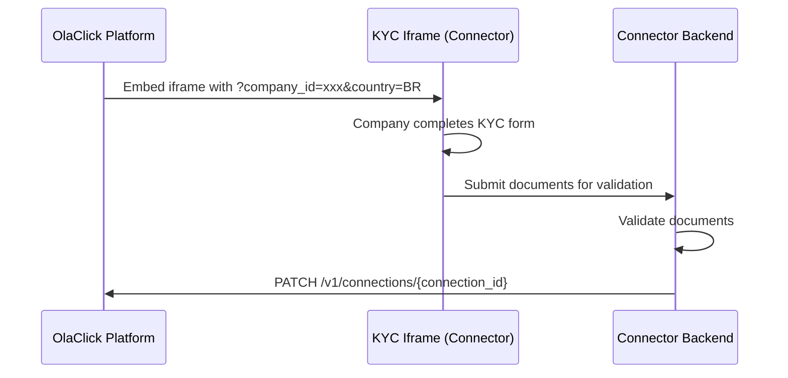
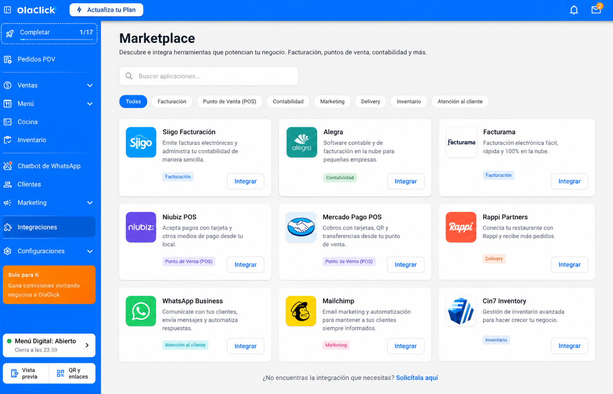

# KYC Iframe

The KYC (Know Your Customer) capture module allows connectors to collect and validate the necessary fiscal documents from OlaClick companies. This module is implemented as an **iframe** that OlaClick embeds in its platform.

## How It Works

1. OlaClick embeds the connector's iframe in its interface
2. OlaClick passes `company_id` and `country` as query parameters
3. The company completes the document validation form inside the iframe
4. Once validated, the connector calls the [Update Connection Status](/modules/fiscal-notes/kyc/update-status) endpoint to notify OlaClick



## Create the Iframe

The connector must expose a public URL that accepts the following query parameters:

```
https://your-domain.com/kyc?company_id={company_id}&country={country}
```

### Query Parameters

| Parameter | Type | Description |
|-----------|------|-------------|
| `company_id` | `string (UUID)` | Unique identifier of the company in OlaClick |
| `country` | `string (ISO 3166-1 alpha-2)` | Company's country code (e.g.: `BR`, `MX`, `CO`, `AR`) |

### URL Example

```
https://your-domain.com/kyc?company_id=550e8400-e29b-41d4-a716-446655440000&country=BR
```

## Iframe Requirements

### Technical

- The URL must be accessible via HTTPS
- Must be responsive (will be displayed at different screen sizes)
- Must not redirect outside the iframe
- Must work without third-party cookies (use `SameSite=None; Secure` if needed)

### Content

The KYC form must capture all necessary documentation according to the country:

| Country | Typical Documents |
|---------|------------------|
| Brazil | CNPJ, Inscricao Estadual, Certificado Digital |
| Mexico | RFC, Constancia de Situacion Fiscal, CSD |
| Colombia | NIT, RUT, Resolucion DIAN |
| Argentina | CUIT, Certificado AFIP |

### UX

- Show clear progress indicators
- Validate fields in real time
- Show descriptive error messages
- Confirm to the user when the process is completed successfully

## Integration in OlaClick

OlaClick embeds the iframe as follows:

```html
<iframe
  src="https://your-domain.com/kyc?company_id=550e8400-e29b-41d4-a716-446655440000&country=BR"
  width="100%"
  height="600"
  frameborder="0"
  allow="camera; microphone"
  sandbox="allow-scripts allow-same-origin allow-forms allow-popups"
></iframe>
```



:::info
The `camera` and `microphone` permissions are included to allow document capture via camera if the connector requires it.
:::

## Style Guide

:::caution[Important]

Compliance with this style guide is **mandatory** for integration homologation. The iframe must look consistent with the OlaClick platform to ensure a seamless user experience.

:::

### Color Palette

| Role | Color | Hex | Usage |
|------|-------|-----|-------|
| Primary | Blue | `#006FFF` | Primary buttons, links, action elements |
| Secondary | Blue | `#003E8F` | Highlighted text, headers, hover states |
| Accent | Green | `#01FFE3` | Badges, success indicators, highlights |
| Error | Red | `#FE5F55` | Error messages, failed validations |
| Success | Green | `#3CAF47` | Confirmations, completed states |
| Warning | Orange | `#FF9800` | Alerts, pending states |
| Info | Blue | `#24A4ED` | Informational messages, tooltips |

### Typography

- **Font family:** `Inter`, `system-ui`, `-apple-system`, `sans-serif`
- **Base size:** `14px`
- **Headings:** Semi-bold (`600`) or Bold (`700`)
- **Body:** Regular (`400`)

### Components

#### Buttons

```css
/* Primary button */
.btn-primary {
  background-color: #006FFF;
  color: #FFFFFF;
  border: none;
  border-radius: 4px;
  padding: 10px 24px;
  font-size: 14px;
  font-weight: 600;
  cursor: pointer;
}

.btn-primary:hover {
  background-color: #003E8F;
}

/* Secondary button */
.btn-secondary {
  background-color: transparent;
  color: #006FFF;
  border: 1px solid #006FFF;
  border-radius: 4px;
  padding: 10px 24px;
  font-size: 14px;
  font-weight: 600;
}
```

#### Inputs

```css
.input-field {
  border: 1px solid #E0E0E0;
  border-radius: 4px;
  padding: 10px 12px;
  font-size: 14px;
  height: 40px;
  width: 100%;
}

.input-field:focus {
  border-color: #006FFF;
  outline: none;
  box-shadow: 0 0 0 2px rgba(0, 111, 255, 0.1);
}

.input-field.error {
  border-color: #FE5F55;
}
```

#### Spacing and Layout

- **Border radius:** `4px` for inputs and buttons, `12px` for cards/modals
- **Base spacing:** multiples of `4px` (8, 12, 16, 24, 32)
- **Form max width:** `600px` centered
- **Iframe internal padding:** minimum `24px`

### General Rules

- Do not use colors outside the defined palette
- Maintain minimum WCAG AA contrast (4.5:1 for text)
- The iframe background must be white (`#FFFFFF`) or light gray (`#F5F5F5`)
- Do not include the connector's own logos prominently
- Error messages must use the color `#FE5F55`
- Success states must use the color `#3CAF47`

## After KYC

Once the connector successfully validates the company's documents, it must:

1. Call the [`PATCH /v1/connections/{connection_id}`](/modules/fiscal-notes/kyc/update-status) endpoint
2. Send `status: "active"` if validation was successful
3. Send `status: "rejected"` with a `reason` if validation failed

:::warning
The connector is responsible for storing KYC documents. OlaClick does not store the company's fiscal documents.
:::
