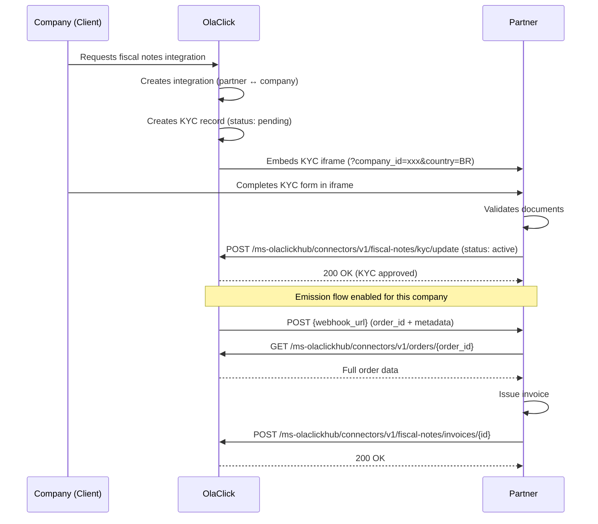

# Fiscal Notes — Onboarding

This guide describes the integration flow for the **Fiscal Notes** module. Before starting, make sure you have completed the [Partner registration](/) and have a valid access token.

## Flow Overview

## How it works

1. A company (OlaClick client) requests the fiscal notes integration
2. **OlaClick creates the integration** between your partner and that company
3. **OlaClick creates a KYC record** with status `pending` for that company
4. OlaClick embeds your KYC iframe so the company can complete document validation
5. Once validated, you update the KYC status to `active` (or `rejected`)
6. If approved, the emission flow is enabled — you start receiving orders for invoicing

:::info
You do not create integrations or KYC records. OlaClick creates them when the client requests the service. Your role is to validate documents and update the KYC status.
:::

## Steps

### 1. Implement the KYC Iframe

OlaClick embeds your iframe when a company needs to complete document validation. The iframe receives `company_id` and `country` as query parameters. At this point, OlaClick has already created the KYC record as `pending`.

→ See [KYC Iframe](/modules/fiscal-notes/kyc-iframe) for full implementation details and style guide.

### 2. Update KYC status

Once the company's documents are validated (or rejected), update the KYC status in OlaClick. This determines whether the emission flow is enabled for that company.

→ See [Update KYC Status](/api-reference/fiscal-notes/update-kyc-status)

### 3. Receive order notifications

Once KYC is approved, OlaClick sends a webhook to your registered URL when an order is ready for invoicing. The webhook contains the `order_id` and metadata.

→ See [Receive Orders](/api-reference/fiscal-notes/receive-orders)

### 4. Fetch order data

Use the order ID from the webhook to fetch the full order details (products, payments, totals).

→ See [Get Order](/api-reference/orders/get-order)

### 5. Notify invoice issued

After emitting the invoice, send the result back to OlaClick.

→ See [Notify Invoice](/api-reference/fiscal-notes/notify-invoice)

### 6. Homologation

Complete the homologation process to get production credentials.

→ See [Homologation](/modules/fiscal-notes/homologation)

## Required Scopes

The `fiscal_notes` integration grants these scopes:

| Scope | Used for |
|-------|----------|
| `fiscal_notes.integration.activate` | Update KYC status for a company |
| `fiscal_notes.invoices.create` | Send issued invoices to OlaClick |
| `orders.order.read` | Fetch order data by ID |
