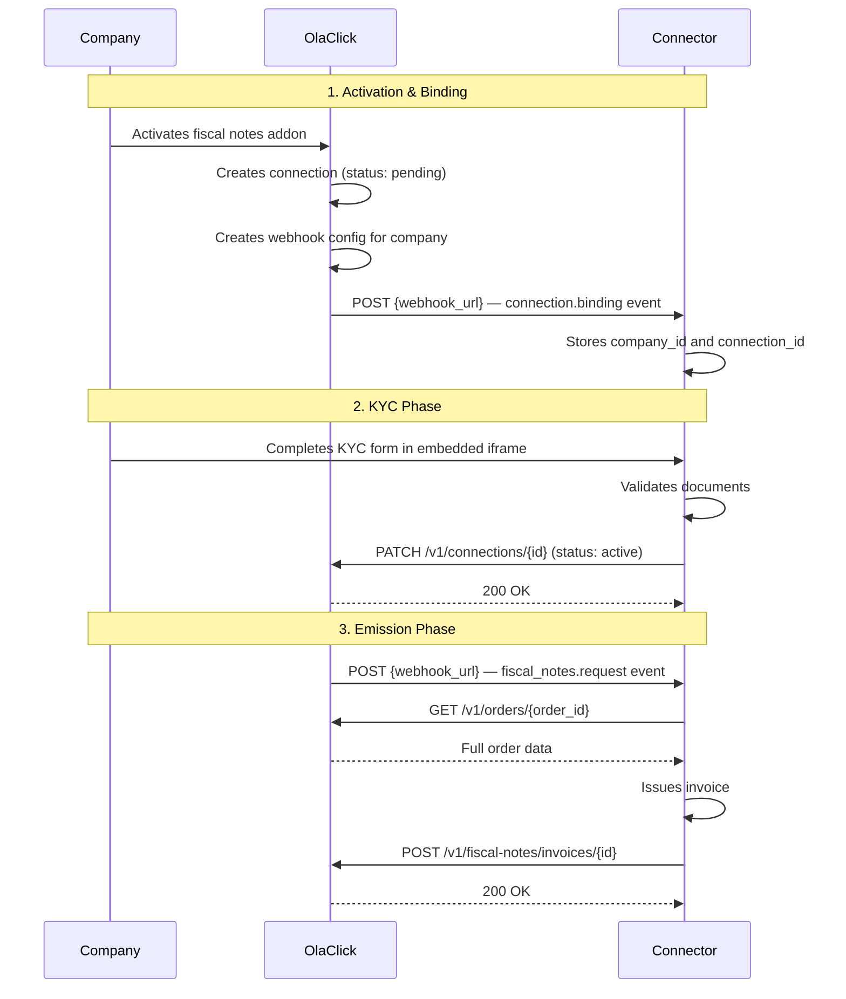

# Fiscal Notes — Onboarding

This guide describes the integration flow for the **Fiscal Notes** module. Before starting, make sure you have completed the [Connector registration](/) and understand the [Authentication](https://developers.olaclick.app/docs/hub/getting-started#step-2-request-a-token) flow.

## Flow Overview



## Phase 1: Activation & Binding

When a company activates the fiscal notes addon in their OlaClick panel:

1. OlaClick creates a **connection** between the company and your connector with status `pending`. The connection object manages the KYC lifecycle.
2. OlaClick creates a **webhook configuration** for that company, pointing to your registered webhook URL.
3. OlaClick sends a **binding event** to your webhook so you know a new company has connected.

### Receive the binding event

OlaClick sends the binding event to the webhook URL you provided during registration:

```http
POST {your_webhook_url}
Content-Type: application/json
X-OlaClick-Signature: sha256={hmac_signature}
```

```json
{
  "event_type": "connection.binding",
  "event_id": "a1b2c3d4-e5f6-7890-abcd-ef1234567890",
  "company_id": "550e8400-e29b-41d4-a716-446655440000",
  "company_name": "Restaurant Example",
  "country_code": "BR",
  "connection_id": "660e8400-e29b-41d4-a716-446655440001",
  "scopes": ["orders:read", "fiscal_notes:write", "connections:write"],
  "activated_at": "2026-05-29T15:00:00.000Z"
}
```

Store the `company_id` and `connection_id` — you will need them for authentication and to update the connection status after KYC.

## Phase 2: KYC

The company sees your KYC iframe embedded in the OlaClick platform. The iframe allows the company to submit their fiscal documents for validation.

### 1. Implement the KYC Iframe

OlaClick embeds your iframe so the company can complete document validation. The iframe receives `company_id` and `country` as query parameters.

→ See [KYC Iframe](/modules/fiscal-notes/kyc/iframe) for implementation details and style guide.

### 2. Update connection status

Once documents are validated (or rejected), update the connection status via the API. This transitions the connection from `pending` to `active` (or `rejected`), enabling or blocking the emission flow.

→ See [Update Connection Status](/modules/fiscal-notes/kyc/update-status)

> **Endpoint:** [`PATCH /v1/connections/{connection_id}`](/modules/fiscal-notes/kyc/update-status)

:::tip
You can update the connection status at any time — not just during the initial KYC. If you need to add an additional validation step or invalidate a previously approved KYC (e.g. expired certificates, compliance issues), simply call the same endpoint to transition the connection back to `pending` or `rejected`. While the connection is not `active`, OlaClick will stop sending events and the connector won't be able to generate company-scoped tokens.
:::

## Phase 3: Emission

Once the connection is `active`, OlaClick starts sending completed orders to your webhook for invoice emission.

### 3. Receive order notifications

OlaClick sends a POST to your webhook URL with the `order_id` and metadata when an order is ready for invoicing.

→ See [Receive Orders](/modules/fiscal-notes/emission/receive-orders)

### 4. Fetch order data

Use the `order_id` from the webhook to fetch the full order details (products, payments, totals, client info). Use the access token for authentication.

→ See [Get Order](/modules/fiscal-notes/emission/get-order)

> **API Reference:** [`GET /v1/orders/:id`](https://developers.olaclick.app/docs/api/orders-controller-get-order) — Get an order

### 5. Emit and notify invoice

After emitting the invoice, send the result back to OlaClick (status: `issued` or `error`).

→ See [Notify Invoice](/modules/fiscal-notes/emission/notify-invoice)

> **Endpoint:** `POST /v1/fiscal-notes/invoices/{invoice_id}`

## Homologation

Complete the homologation process to get production access.

→ See [Homologation](/modules/fiscal-notes/homologation)

## Required Scopes

The `fiscal_notes` module uses these scopes:

| Scope | Level | Used for |
|-------|-------|----------|
| `orders:read` | company | Fetch order data by ID |
| `fiscal-notes:write` | company | Notify invoice results to OlaClick |
| `conections:write` | connector | Update connection status (KYC approval/rejection) |
