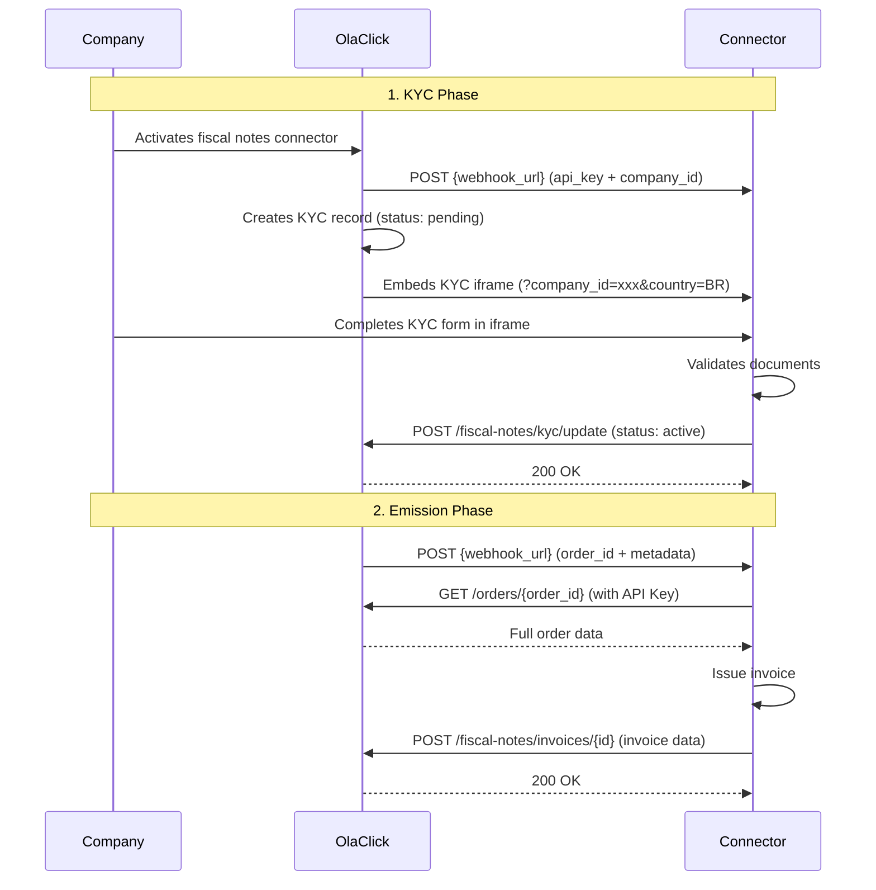

# Fiscal Notes — Onboarding

This guide describes the integration flow for the **Fiscal Notes** module. Before starting, make sure you have completed the [Connector registration](/) and received your first company API key.

## Flow Overview

## Phase 1: KYC

When a company activates your integration, OlaClick sends you their API key via your webhook and creates a KYC record as `pending`. You must validate the company's fiscal documents before invoicing can begin.

### 1. Receive the API Key

OlaClick sends the company's API key to your webhook URL (see [Get Started](/#2-receive-api-keys-from-companies)). Store it associated to the `company_id`.

### 2. Implement the KYC Iframe

OlaClick embeds your iframe so the company can complete document validation. The iframe receives `company_id` and `country` as query parameters.

→ See [KYC Iframe](/modules/fiscal-notes/kyc/iframe) for implementation details and style guide.

### 3. Update KYC status

Once documents are validated (or rejected), update the KYC status. This enables or blocks the emission flow for that company.

→ See [Update KYC Status](/modules/fiscal-notes/kyc/update-status)

## Phase 2: Emission

Once KYC is approved, OlaClick starts sending completed orders to your webhook for invoice emission.

### 4. Receive order notifications

OlaClick sends a POST to your webhook URL with the `order_id` and metadata when an order is ready for invoicing.

→ See [Receive Orders](/modules/fiscal-notes/emission/receive-orders)

### 5. Fetch order data

Use the `order_id` from the webhook to fetch the full order details (products, payments, totals, client info). Use the company's API key for authentication.

→ See [Get Order](/modules/fiscal-notes/emission/get-order)

### 6. Emit and notify invoice

After emitting the invoice, send the result back to OlaClick (status: `issued` or `error`).

→ See [Notify Invoice](/modules/fiscal-notes/emission/notify-invoice)

## Homologation

Complete the homologation process to get production access.

→ See [Homologation](/modules/fiscal-notes/homologation)

## Required Scopes

The `fiscal_notes` module grants these scopes (included in the company's API key):

| Scope | Used for |
|-------|----------|
| `fiscal_notes.integration.activate` | Update KYC status for a company |
| `fiscal_notes.invoices.create` | Send issued invoices to OlaClick |
| `orders.order.read` | Fetch order data by ID |
