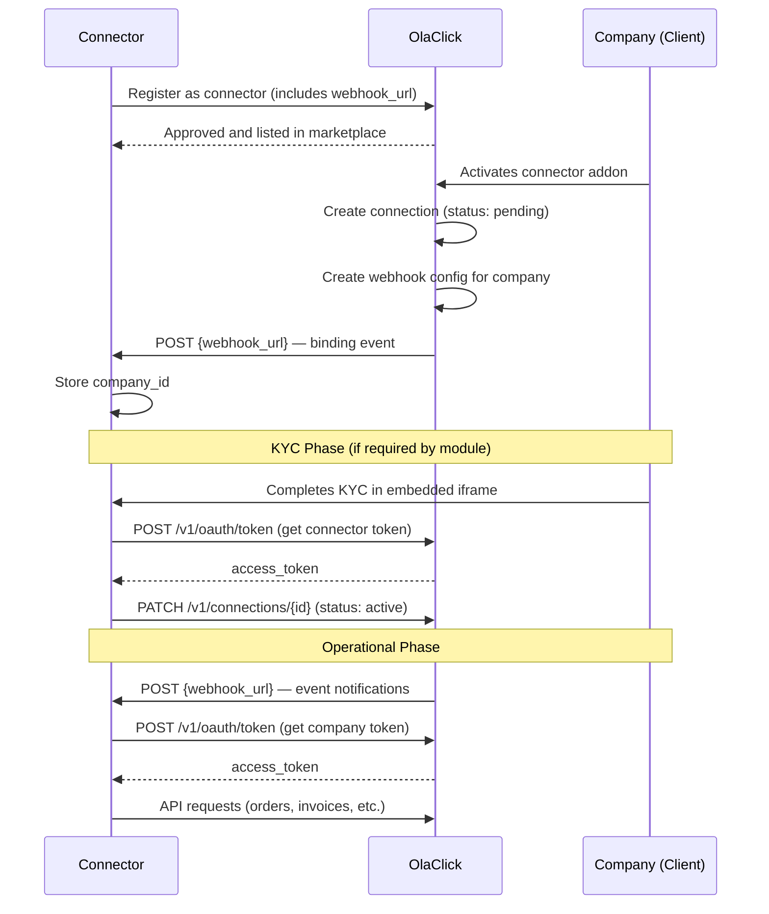

# Get Started

Welcome to the **OlaClick Connectors** integration portal. This guide describes how to register as a connector and integrate with OlaClick companies.

## How it works



## 1. Register as a connector

Contact the OlaClick integrations team and provide:

| Field | Description | Required |
|-------|-------------|:--------:|
| Connector name | Display name in the marketplace (e.g. "Nubefact") | Yes |
| Description | Brief description of what your integration does | Yes |
| Category | Integration category (e.g. "Fiscal Notes", "Delivery Apps") | Yes |
| Logo | URL to your connector's logo image | Yes |
| Contact email | Email for technical communication | Yes |
| Allowed countries | Countries where the integration will operate (e.g. `["BR", "MX", "CO", "AR"]`) | Yes |
| Modules | Modules to enable (see below) | Yes |
| Webhook URL | URL where OlaClick will send events when a company activates your connector | Yes |

Once approved, your connector is listed in the OlaClick Marketplace for the countries you selected.

### Available Modules

| Module | Description | Scopes granted |
|--------|-------------|----------------|
| `fiscal_notes` | Electronic invoicing (KYC + emission) | `orders:read`, `fiscal-notes:write`, `conections:write` |

:::info
More modules will be available in the future. Currently only `fiscal_notes` is supported.
:::

## 2. Receive binding events from companies

When a company activates your connector from the OlaClick Marketplace:

1. OlaClick creates a **connection** between the company and your connector with status `pending`
2. OlaClick creates a **webhook configuration** for that company pointing to your webhook URL
3. OlaClick sends a **binding event** to your webhook URL

```http
POST {your_webhook_url}
Content-Type: application/json
X-OlaClick-Signature: sha256={hmac_signature}
```

```json
{
  "event_type": "connection.binding",
  "event_id": "a1b2c3d4-e5f6-7890-abcd-ef1234567890",
  "company_id": "550e8400-e29b-41d4-a716-446655440000",
  "company_name": "Restaurant Example",
  "country_code": "BR",
  "connection_id": "660e8400-e29b-41d4-a716-446655440001",
  "scopes": ["orders:read", "fiscal-notes:write", "conections:write"],
  "activated_at": "2026-05-29T15:00:00.000Z"
}
```

**Your responsibility as a connector:**
- Expose a webhook endpoint that receives this payload
- Store the `company_id` and `connection_id` associated to your internal records
- Respond with `200 OK` to confirm receipt

:::danger
Each connection is unique per company. Never mix data between companies.
:::

## 3. Authenticate with the API

Use the OAuth 2.0 client credentials flow to obtain an access token scoped to a specific company. See the [Authentication section in the API Reference](https://developers.olaclick.app/docs/hub/getting-started#step-2-request-a-token) for full details on how to obtain and use tokens.

## 4. Complete homologation

Before going to production, you must complete the homologation process for each module you selected. Each module has an independent homologation.

- **Fiscal Notes** → [Homologation](/modules/fiscal-notes/homologation)

## Best Practices

### Process webhook events asynchronously

Always respond with `200 OK` immediately and process the event in background. If your endpoint takes too long to respond, the connection may time out and OlaClick will register the delivery as failed — triggering retries.

Repeated delivery failures can lead to your webhook being **suspended**. To avoid this:

- Persist the event payload to a queue or database as soon as you receive it
- Return `200 OK` within a few seconds
- Process the event asynchronously (e.g. via a background worker)

### Handle idempotency

Since failed deliveries trigger retries, you may receive the same event more than once. Always deduplicate using the `event_id` field to avoid processing duplicates.

### Retry on 401 — token refresh strategy

When making API calls with a company-scoped token and you receive a `401` response:

1. Request a new access token for that company
2. Retry the original request **once** with the new token
3. If it fails again, log the error — do not retry indefinitely

This prevents losing events due to expired tokens during processing.

### Cache tokens properly

- Store access tokens in cache using the `expires_in` value from the token response as TTL
- When any API response returns `401`, invalidate the cached token for that company and request a new one
- Never request a new token for every API call — use the cached one until it expires or is rejected

### Verify webhook signatures

Always verify the `X-OlaClick-Signature` header before processing any event. This ensures the payload was sent by OlaClick and hasn't been tampered with. Reject requests with invalid or missing signatures — this protects against forged events from malicious actors.

## Next steps

Proceed to the integration module documentation:

- **Fiscal Notes** → [Fiscal Notes Onboarding](/modules/fiscal-notes/onboarding)
