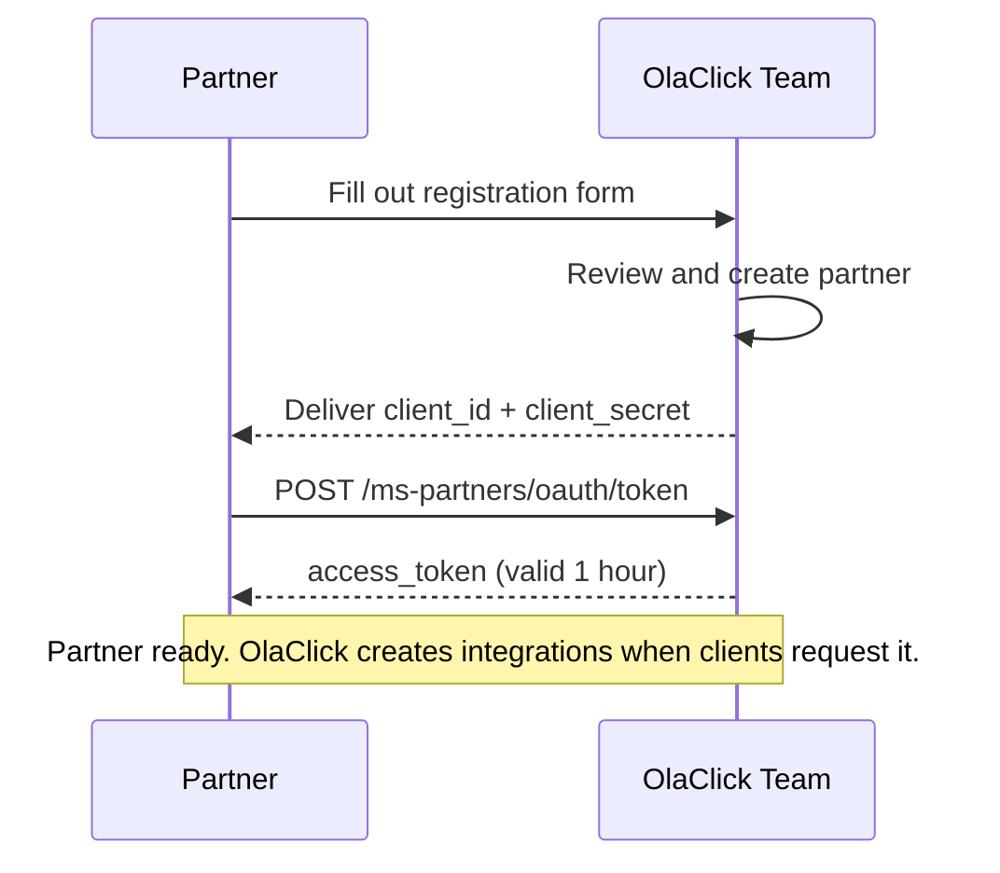

# Onboarding

This guide describes how to register as an **OlaClick Partner** and obtain your credentials.



## 1. Fill out the registration form

Contact the OlaClick integrations team and provide:

| Field | Description | Required |
|-------|-------------|:--------:|
| Partner name | Name of your company (e.g. "Nubefact") | ✅ |
| Contact name | Full name of the technical contact person | ✅ |
| Contact email | Email for technical communication | ✅ |
| Contact phone | Phone number for urgent matters | ✅ |
| Description | Brief description of what your integration does | ✅ |
| Countries | Countries where the integration will operate (e.g. BR, MX, CO, AR) | ✅ |
| Integrations | Modules to enable (see below) | ✅ |

### Available Integrations

| Integration | Description | Scopes granted |
|-------------|-------------|----------------|
| `fiscal_notes` | Electronic invoicing (KYC + emission) | `fiscal_notes.integration.activate`, `fiscal_notes.invoices.create`, `orders.order.read` |

:::info
More integration modules will be available in the future. Currently only `fiscal_notes` is supported.
:::

## 2. Receive your credentials

Once approved, OlaClick will send you:

| Credential | Description |
|------------|-------------|
| `client_id` | Your partner's unique identifier |
| `client_secret` | Your secret key for authentication |

:::danger
Store your `client_secret` securely. It will only be shared once. If lost, a new one must be generated (which invalidates the previous one).
:::

## 3. Get an access token

Use your credentials to obtain a Bearer token:

```bash
curl -X POST https://api.olaclick.app/ms-partners/oauth/token \
  -H "Content-Type: application/x-www-form-urlencoded" \
  -d "grant_type=client_credentials&client_id=YOUR_CLIENT_ID&client_secret=YOUR_CLIENT_SECRET"
```

```json
{
  "access_token": "eyJhbGciOiJSUzI1NiIsInR5cCI6IkpXVCJ9...",
  "token_type": "Bearer",
  "expires_in": 3600
}
```

Include this token in all requests: `Authorization: Bearer {access_token}`

For full details on token renewal, see [Authentication](/authentication).

## 4. Company integrations

OlaClick creates integrations between your partner and specific companies when a client requests it. You do not create integrations yourself — OlaClick handles this internally.

Once an integration exists for a company, the fiscal notes flow begins (KYC → emission).

## Next steps

Proceed to the integration module documentation:

- **Fiscal Notes** → [Fiscal Notes Onboarding](/fiscal-notes/onboarding)
