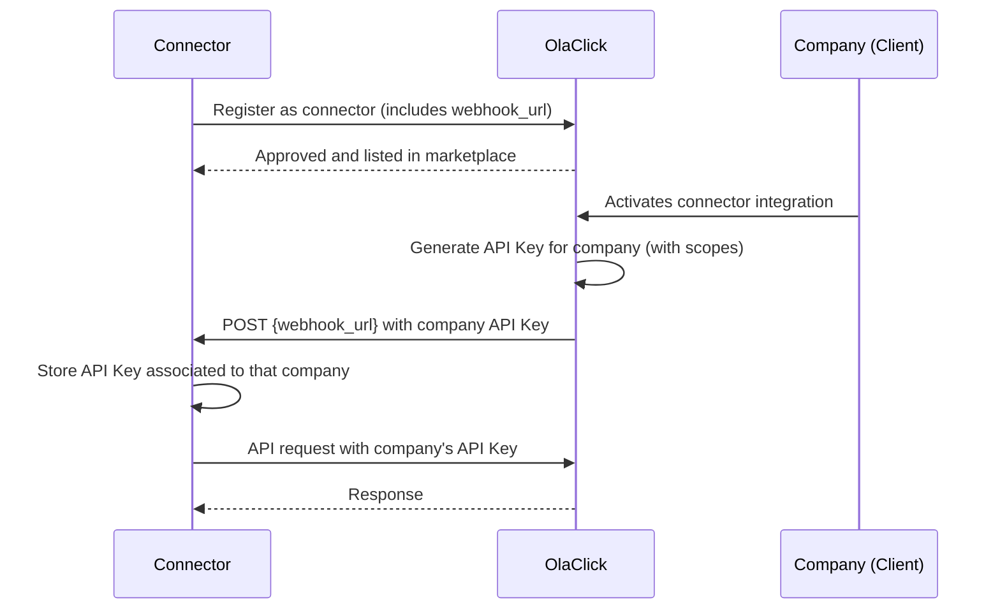

# Get Started

Welcome to the **OlaClick Partners** integration portal. This guide describes how to register as a connector and integrate with OlaClick companies using their API keys.

## How it works



## 1. Register as a connector

Contact the OlaClick integrations team and provide:

| Field | Description | Required |
|-------|-------------|:--------:|
| Connector name | Name of your company (e.g. "Nubefact") | ✅ |
| Contact name | Full name of the technical contact person | ✅ |
| Contact email | Email for technical communication | ✅ |
| Contact phone | Phone number for urgent matters | ✅ |
| Description | Brief description of what your integration does | ✅ |
| Countries | Countries where the integration will operate (e.g. BR, MX, CO, AR) | ✅ |
| Modules | Modules to enable (see below) | ✅ |
| Webhook URL | URL where OlaClick will send the company's API Key when a company activates your integration | ✅ |

Once approved, your integration is listed in the OlaClick Marketplace for the countries you selected.

### Available Modules

| Module | Description | Scopes granted |
|--------|-------------|----------------|
| `fiscal_notes` | Electronic invoicing (KYC + emission) | `fiscal_notes.integration.activate`, `fiscal_notes.invoices.create`, `orders.order.read` |

:::info
More modules will be available in the future. Currently only `fiscal_notes` is supported.
:::

## 2. Receive API Keys from companies

When a company activates your integration from the OlaClick Marketplace, OlaClick will send the company's API Key to your **webhook URL** via a POST request:

```http
POST {your_webhook_url}
Content-Type: application/json
X-OlaClick-Signature: sha256={hmac_signature}
```

```json
{
  "event": "integration.activated",
  "company_id": "550e8400-e29b-41d4-a716-446655440000",
  "company_name": "Restaurant Example",
  "country_code": "BR",
  "api_key": "eyJhbGciOiJSUzI1NiIsInR5cCI6IkpXVCJ9...",
  "scopes": ["fiscal_notes.integration.activate", "fiscal_notes.invoices.create", "orders.order.read"],
  "activated_at": "2026-05-29T15:00:00.000Z"
}
```

**Your responsibility as a connector:**
- Expose a webhook endpoint that receives this payload
- Store the `api_key` securely, associated to the `company_id`
- Respond with `200 OK` to confirm receipt
- Use the correct API Key when making requests on behalf of that company

:::danger
Each API Key is unique per company. Never use one company's key for another company's data.
:::

## 3. Use the API Key

Include the company's API Key in the `Authorization` header of all requests:

```bash
curl -X GET https://public-api.olaclick.app/v1/orders/{order_id} \
  -H "Authorization: Bearer {company_api_key}"
```

The API Key already contains the scopes and company context — no additional authentication step is needed.

For full details, see [Authentication](/authentication).

## 4. Complete homologation

Before going to production, you must complete the homologation process for each module you selected. Each module has an independent homologation.

- **Fiscal Notes** → [Homologation](/modules/fiscal-notes/homologation)

## Next steps

Proceed to the integration module documentation:

- **Fiscal Notes** → [Fiscal Notes Onboarding](/modules/fiscal-notes/onboarding)
